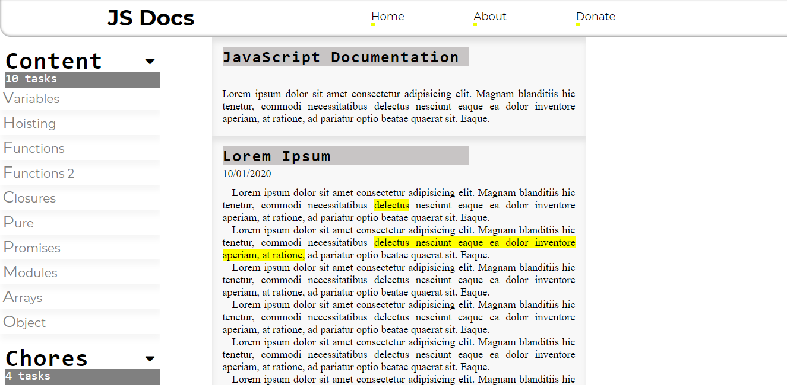

# Documentation Project

+ CSS 
+ HTML
+ JAVASCRIPT 

- [x] Make a documentation page 
- [x] Don't use any kind of Frameworks 
- [x] Make it responsive and iterable, assigning some effects 
- [x] Learn something

*made with :yellow_heart:*
